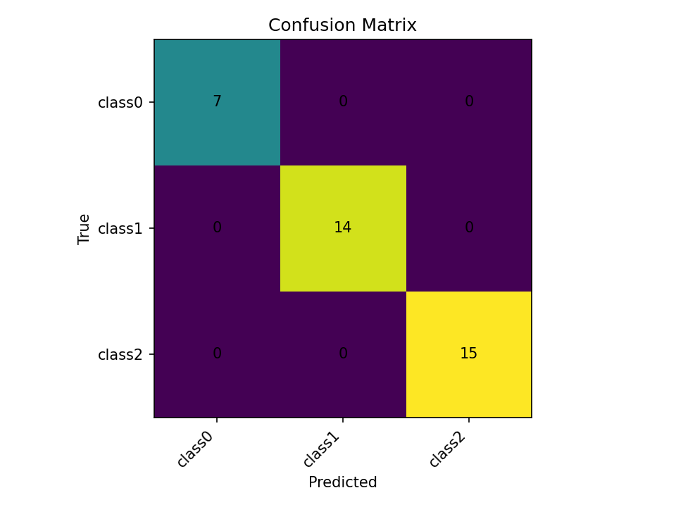
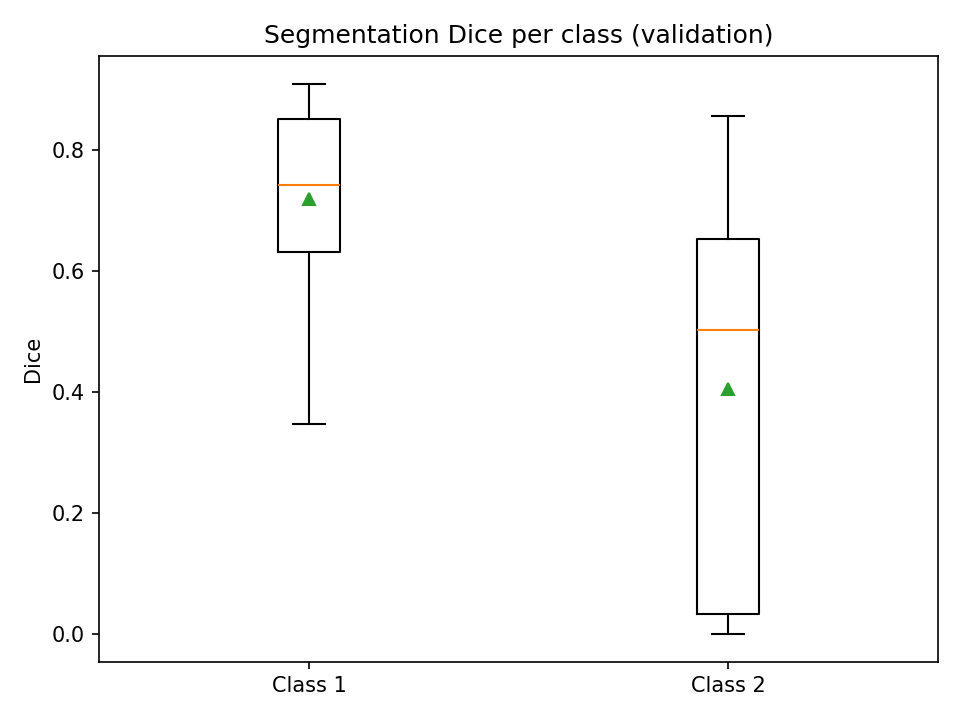

# multitask_deeplearning_pancreas_ct
Multi-task **pancreas lesion segmentation** + **subtype classification** using **nnU-Net v2** 
> Tested with: Python 3.10, PyTorch (CUDA 11.8 wheels), nnU-Net v2 (editable install)
## Setup
### Prepare data
```bash
git clone https://github.com/Hassan9001/multitask_deeplearning_pancreas_ct.git
cd multitask_deeplearning_pancreas_ct/nnUNet
pip install -e .
cd ..
# place Unstructured datafolder in root folder before running:
python clean_mac_artifacts.py # optional
python dataset_conversion.py
# temporarily set environment variables (cmd code style)
set nnUNet_raw=FullDirectory/nnUNet_raw
set nnUNet_preprocessed=Your-Directory/nnUNet_preprocessed
set nnUNet_results=Your-Directory/nnUNet_results
```
### Data preprocessing with ResEncM planner (I only did 2D configuration because of limited computational resources)
```bash
nnUNetv2_plan_and_preprocess -d 777 -c 2d -pl nnUNetPlannerResEncM --verify_dataset_integrity
```
Note: use the custom nnUNetResEncUNetMPlans.json
### Training 5 fold cross-validation (I only completed 1 (hardware issues came up))
```bat
nnUNetv2_train 777 2d 0 -tr nnUNetTrainer -p nnUNetResEncUNetMPlans --npz
nnUNetv2_train 777 2d 1 -tr nnUNetTrainer -p nnUNetResEncUNetMPlans --npz
nnUNetv2_train 777 2d 2 -tr nnUNetTrainer -p nnUNetResEncUNetMPlans --npz
nnUNetv2_train 777 2d 3 -tr nnUNetTrainer -p nnUNetResEncUNetMPlans --npz
nnUNetv2_train 777 2d 4 -tr nnUNetTrainer -p nnUNetResEncUNetMPlans --npz
```
### Inference(fast preset, ≥10% faster)
#### Predict (Predict the test cases)
```code
nnUNetv2_predict -i nnUNet_raw/Dataset777_3DMedImg/imagesTs -o inference_output -d 777 -c 2d -p nnUNetResEncUNetMPlans -f 0 --save_probabilities
```
#### Evaluate on original validation (optional)
```code
nnUNetv2_predict -i nnUNet_raw/Dataset777_3DMedImg/imagesVa -o inference_val_output -d 777 -c 2d -p nnUNetResEncUNetMPlans -f 0

nnUNetv2_evaluate_folder nnUNet_raw/Dataset777_3DMedImg/labelsVa inference_val_output -djfile inference_val_output/dataset.json -p inference_val_output/plans.json
```
#### Apply postprocessing after 
Finally, apply the previously determined postprocessing to the (ensembled) predictions: 
```commandline
nnUNetv2_apply_postprocessing -i FOLDER_WITH_PREDICTIONS -o OUTPUT_FOLDER --pp_pkl_file POSTPROCESSING_FILE -plans_json PLANS_FILE -dataset_json DATASET_JSON_FILE
```
#### Create Figures
```shell
python eval_plots.py --pred inference_val_output --labels nnUNet_raw/Dataset777_3DMedImg/labelsVa --out inference_val_output/figs
```
---

## File Structure

```bash
multitask_deeplearning_pancreas_ct/
├─ README.md
├─ nnUNet/                        # nnU-Net v2 (editable install)
│  └─ nnunetv2/
│     ├─ MultitaskUNet.py
│     ├─ inference/predict_from_raw_data.py        # extended to save classification outputs
│     ├─ training/dataloading/data_loader.py       # emits classTarget + robust keys
│     └─ training/nnUNetTrainer/nnUNetTrainer.py   # seg + cls losses; logging
├─ nnUNet_preprocessed/
│  └─ Dataset777_3DMedImg/
│     └─ nnUNetResEncUNetMPlans.json               # custom plans (committed)
├─ nnUNet_raw/ (not committed)
│  └─ Dataset777_3DMedImg/ (imagesTr, labelsTr, imagesVa, labelsVa, imagesTs)
├─ dataset_conversion.py
├─ clean_mac_artifacts.py
└─ eval_plots.py
```

## Changes to nnUNet Files
- A custom network: Residual Encoder UNet + Classifier
1) New ustom network (Residual Encoder UNet mod) that returns (segmentation & classification) - nnUNet/nnunetv2/MultitaskUNet.py
    - Modify network’s forward pass to return both outputs
2) Make the dataloaders emit a classification target - nnUNet/nnunetv2/training/dataloading/data_loader.py
3) Update trainer handle both segmentation and classification losses - nnUNet/nnunetv2/training/nnUNetTrainer/nnUNetTrainer.py
    - Build segmentation loss and classification loss.
    - In training step: output, classOutput = self.network(data) and loss = segLoss + 3 * classLoss
    - Update trainer class to handle classTarget in train_step and validation_step
    - In validation: call predictor.predict_sliding_window_return_logits, aggregate softmax-mean and save CSV.
4) Inference: predictor returns both segmentation & class logits, writes CSV - nnUNet/nnunetv2/inference/predict_from_raw_data.py
    - _internal_maybe_mirror_and_predict, _internal_predict_sliding_window_return_logits, and predict_sliding_window_return_logits
    - Write classification_results.csv
5) Plans: point the pipeline at the new model (nnUNet/nnunetv2/MultitaskUNet.py) and num of classes - nnUNet_preprocessed/Dataset777_3DMedImg/nnUNetResEncUNetMPlans.json
6) Evaluation and metrics - nnUNet/nnunetv2/evaluation/evaluate_predictions.py
  - Evaluation and metrics
    - Extend the evaluation script to compute classification metrics (accuracy, AUC, etc.).
    - log both segmentation and classification performance.
7) Various other little changes

<!--   -->

--- 

# 📊 Results

<p align="center">
  
  
</p>

## VALIDATION Inference
| Metric              | Value        |
|---------------------|--------------|
| **Accuracy**         | 0.778         |
| **F 1** | 0.791         |
| **Average Precision** | 0.838         |
| **Brier Score**       | 0.104         |

